# h1 Viisikko
Tämä on palvelinten hallinta -kurssin ensimmäisen viikkotehtävän raportti. Raportti koostuu kuudesta tehtävästä (x-e) ja niiden ratkaisuista. Tehtävänanto löytyy https://terokarvinen.com/palvelinten-hallinta/#h1-viisikko.
Työskentely tapahtuu kotona omalla kannettavalla, joka on kevyeen pelikäyttöön tarkoitettu. Käyttöjärjestelmänä Windows 11 Home, ja tehtävien tekemiseen VirtualBoxin kautta asennettu Linux Debian Bookworm.

### UPDATE 7.11.2024 klo 14.30
E tehtävä on jäänyt aikaisemmin tekemättä, koska siihen ei löytynyt ymmärrystä. Kotitehtävien läpikäynnin yhteydessä oppitunnilla kuitenkin tuli vinkkejä, ja tehtävä E on ratkaistu tämän väliotsikon päivämäärällä.

## x) Lue ja tiivistä
Raportissa on tiivistettynä artikkelien keskeinen sisältö.
### Run Salt Command Locally
- Salt komentoja voi ajaa paikallisesti, mutta yleensä sitä käytettään ison määrän "orja"koneiden hallitsemiseen.
- Tärkeimmät keskitetyn hallinnan tilafunktiot ovat pkg, file, service, user ja cmd
- Ärtikkeli esittelee komennot edellisten tilafunktioiden ajamiseen
(Karvinen, T. 2021. https://terokarvinen.com/2021/salt-run-command-locally/)
### Salt Quickstart – Salt Stack Master and Slave on Ubuntu Linux
- Artikkeli esittelee Saltin masterin ja orjan asennuksen sekä komentoja, joilla orjia voi käskeä
- Orjatietokoneet voivat olla missä päin verkkoa tahansa: muutetussa IP-osoitteessa, palomuurin takana ja tuntemattomassa osoitteessa ja niitä pystyy silti hallitsemaan
- Ainoastaan master-palvelimella pitää olla julkinen palvelin sekä tunnettu osoite
(Karvinen, T.2018. https://terokarvinen.com/2018/03/28/salt-quickstart-salt-stack-master-and-slave-on-ubuntu-linux/)
### Raportin kirjoittaminen
- Raporttia tulee kirjoittaa samalla kun työskentelee
- Raportti toimii samalla muistiinpanoina
- Varsinkin vikatilanteissa raportin tekeminen on tärkeää
- Raportin tulisi olla täsmällinen, kaikkine polkuineen, tapahtumineen, kellonaikoineen sekä ympäristöineen jossa tehtäviä suoritetaan
- Raportissa tulisi olla siisti ulkoasu, jotta sen lukeminen helpottuu
(Karvinen, T. 2006. https://terokarvinen.com/2006/06/04/raportin-kirjoittaminen-4/)

## a) Debian 12 Bookwormin asennus virtuaalikoneeseen 28.10.2024 17:10-17:40
Asennus toimii. Ohjeet https://terokarvinen.com/2021/install-debian-on-virtualbox/
Asennuksen jälkeen päivitys, upgradet, palomuuri sekä palomuurin päälle laittaminen. Komennot alla

`sudo apt-get update`

`sudo apt-get -y dist-upgrade`

`sudo apt-get -y install ufw`

`sudo ufw enable`

## b) Saltin asennus virtuaalikoneelle 28.10.2024 17:45-18:12
Tehtävänä on asentaa Salt (salt-minion) juuri luodulle virtuaalikoneelle. Aloitus updatella (asennukset ei toimi ennen sitä). Sen jälkeen itse Saltin asennus ja testaus. Komennot, jotka käytössä, alla.
Tehtävässä auttoi Tero Karvisen Salt-artikkelit (Lähteissä), Tehtävänannon kommenttikentässä oleva Tero Karvisen hakemiston luontiohje, sekä Salt Projectin sivusto, jossa asennusohjeet Saltille. https://docs.saltproject.io/salt/install-guide/en/latest/topics/install-by-operating-system/debian.html#install-debian. Aloitettiin hakemiston luonnilla (tehtävänanto), jonka jälkeen komennot.

`sudo apt-get update` päivitys

`sudo apt-get -y install salt-master` Salt "Herran" asennus

`sudo apt-get -y install salt-minion` Salt orjan asennus

`sudo systemctl enable salt-master` demoni käyntiin

`sudo systemctl enable salt-minion` demoni käyntiin

`sudo salt-call --version` tarkistellaan, että asennus on paikallaan

Versio 3007.1 asennettuna.

## c) Viisi tärkeintä tilafunktiota
Tehtävässä tarkoitus näyttää esimerkit viidestä tärkeimmästä Saltin tilafunktiosta, eli pkg, file, service, user ja cmd. Vinkit Artikkelissa Salt Call Locally (Karvinen, T. 2021). Tilafunktioilla on käytännössä tarkoitus selvittää, onko jokin jo olemassa, ja jos ei ole, korjata tilanne.

### pkg 28.10.2024 18:15-18:35
pkg-tilafunktiolla tarkastellaa, onko joku sovellus asennettuna. Jos ei ole, se asennetaan. Pkg-tilaa voidaan käyttää sekä `pkg.installed`, asennettu, tai `pkg.removed`, poistettu.
Seuraavalla komennolla voidaan asentaa "tree" niminen paketti, jolla voidaan ottaa hakemistosta puumainen kuva. Päivitys on jo otettu aiemmin, eli suoraan asennukseen. Local -komennossa tarkoittaa, että nämä komennot ajetaan paikallisesti.

`sudo salt-call --local state.single pkg.installed tree`
Kuvassa näkyvissä, että tree-paketti on asennettu (succeeded, changed) onnistuneesti.

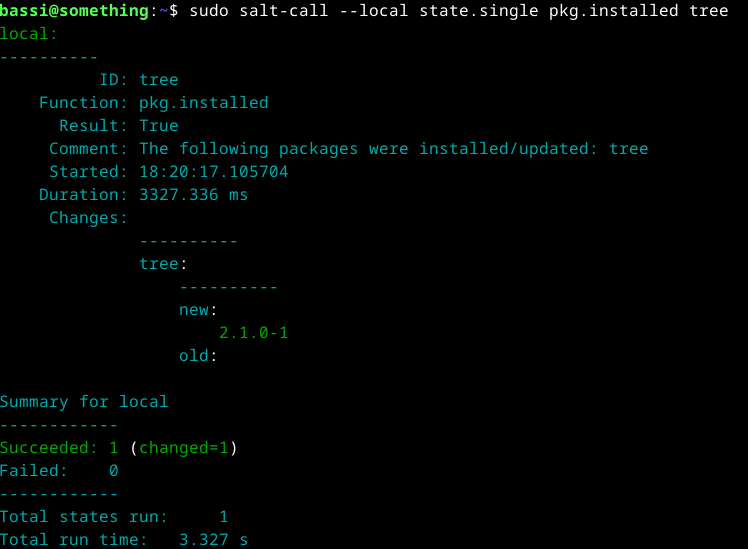

### file 28.10.2024 18:40-18:50
File-tilafunktiolla tarkastellaan, löytyykö joku tiedosto. Jos ei löydy, se luodaan (file.managed). Tarkasteluun kelpaa myös, jos halutaan poistaa tiedostoja (file.absent). Alle olevassa esimerkissä tarkastelen, löytyykö tiedosto. Se ei löydy, joten se luodaan.

`sudo salt-call --local state.single file.managed /tmp/testi1`

Kuvassa näkyy tulos, onnistunut yksi tyhjän tiedoston luonti, koska sitä ei ollut vielä olemassa.
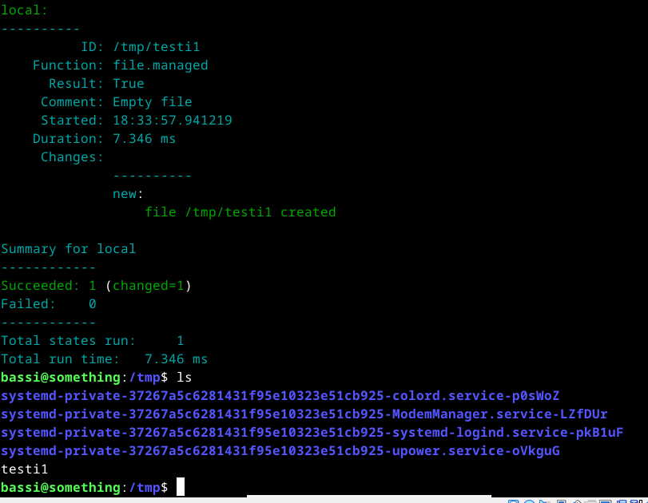

Poistin tiedoston vielä komennolla `sudo salt-call --local state.single file.absent /tmp/testi1`
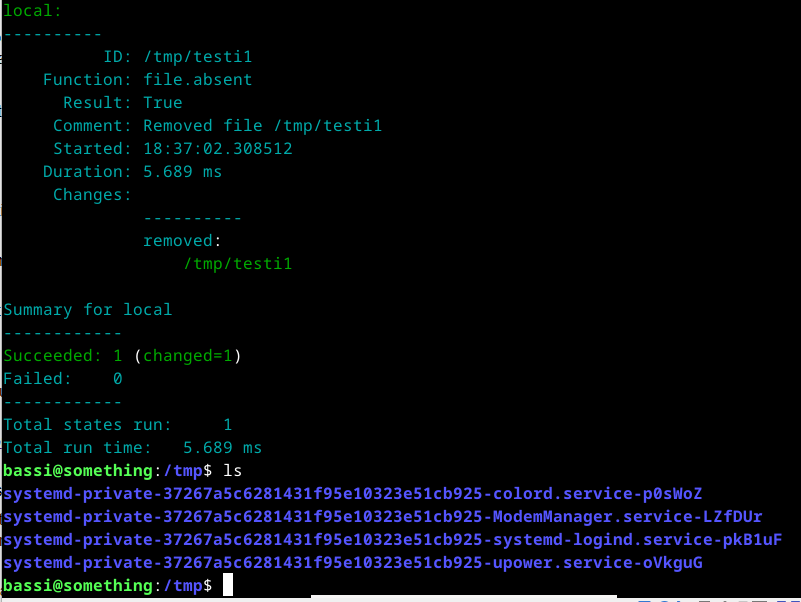

### service 28.10.2024 19:50-20:10
Service funktiota voidaan käyttää demonin uudelleenkäynnistykseen, mikäli sen asetuksissa tapahtuu muutoksia ja ne halutaan käyttöön. Esimerkissä käytän apache2 -palvelinta, jota ei ole asennettuna tälle koneelle. Asennuksen vaiheita on kuvattu kuitenkin https://github.com/guikka4/linux-course/blob/main/h5/h5_koko_juttu.md.

Esimerkissä ajan komennot, joilla voidaan ajaa joko käynnistys, tai sammutustilat demonille (tässä tapauksessa apache2:lle). Koska, ko. demonia ei ole asennettuna tällä koneella, osaa Salt myös ilmoittaa tästä. Lisäsin "-l info" komentoon, sillä saan tietoja komennon tapahtumista.

`sudo salt-call --local -l info state.single service.running apache2 enable=True`. Koska ei ole asennusta, tulee "not available" ja failed.
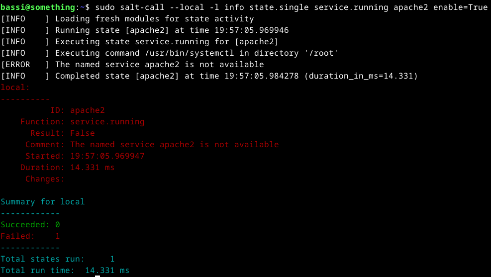

`sudo salt-call --local -l info state.single service.dead enable=False`. Koska ei asennettuna, tulee edelleen "not available", mutta koska ehtona oli, ettei tämä palvelu ole käynnissä, tulee succeeded.
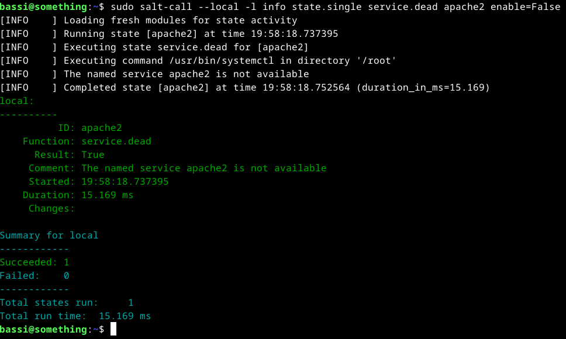

### user 28.10.2024 20:10-20:20
user.present tilafunktiolla voidaan tarkistella, onko käyttäjää. Ja jos ei ole, tehdä se (user.present). Sama käyttäjän poisto (user.absent).

`sudo salt-call --local state single user.present peesi`. Tällä luodaan käyttäjä "peesi", mikäli sitä ei löydy. Käyttäjää ei ollut, joten se luodaan. Samalla tulee luotua käyttäjäryhmä sekä kotihakemisto.
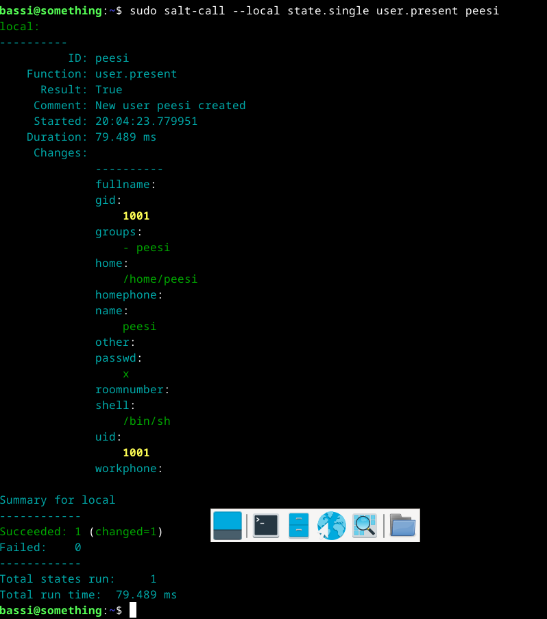

`sudo salt-call --local state single user.absent peesi`. Tällä poistetaan käyttäjä "peesi", mikäli se on vielä olemassa. 
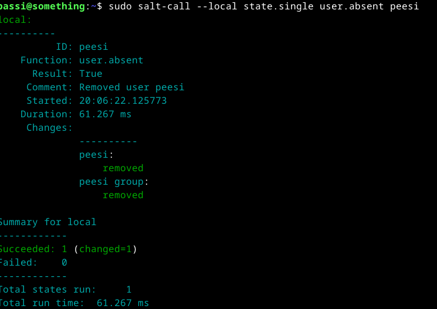

Huom, poistetun käyttäjän kotihakemisto jää vielä olemaan, mikä on hyvä asia. Jos käyttäjä poistetaan, jää hänen tiedostonsa vielä yritykselle.
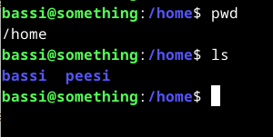

### cmd 28.10.2024 20:20-20:25
cmd.run komennolla ajetaan joku tiedosto. Olisiko niin, että jos tekstitiedostossa, mitä tällä komennolla ajetaan, löytyy joku komento, se suoritetaan, mikäli se ei ole jo suoritettu? Tämä pitää tarkistaa.

## d) Idempotentti 28.10.2024 18:35-18:40
Idempotentti tarkoittaa, että ei jotain komentoa ei enää voi toistaa. Esimerkkinä käytän tässä aiemmin tehtyä "tree" paketin asennusta. Ajan saman komennon `sudo salt-call --local state.single pkg.installed tree` uudestaan. Siitä huomaan, että asennus ei onnistu uudestaan, mikään ei muutu, koska paketti on jo asennettu. Tätä voi toistaa useamminkin, ja aina sama lopputulema.

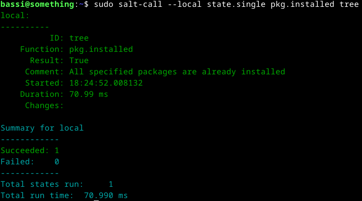

## e) Herra-orja arkkitehtuuri 7.11.2024 14:30-
Testaan herra-orja arkkitehtuuria lokaalisti. Salt on asennettu. Alla komennot ja tapahtumat, miten testi etenee.
`sudo apt-get update` päivitykset
`sudo salt-key --list all` komennolla katselin, että hyväksymättömiä avaimia ei ole tällä hetkellä. Tähän tökkäsi 28.10. tekeminen.
`sudoedit /etc/salt/minion` editoidaan minionin tiedostoja, ja kirjoitetaan ilman kommenttia `master: localhost`. Tällä saadaan orjalta avain, jonka masterilla voi hyväksyä
`sudo systemctl restart salt-minion.service` potkitaan demoni uudelleen käyntiin, jotta saadaan avain minionilta
`sudo salt-key --list all` näyttää, että nyt minionin avain löytyy hyväksymättömistä avaimista

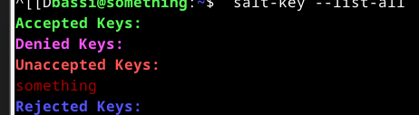

`sudo salt-key -A` hyväksytään kaikki avaimet.

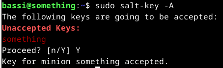

Kysytään minioneilta, ketä käyttäjiä löytyy `sudo salt '*' cmd.run 'whoami'`. Vastaus tulee minionilta.

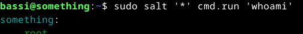

## Lähteet
- Hartikainen, P. 2024. https://github.com/guikka4/linux-course/blob/main/h5/h5_koko_juttu.md. Luettavissa 28.10.2024
- Karvinen, T. 2006. https://terokarvinen.com/2006/06/04/raportin-kirjoittaminen-4/. Luettavissa 26.10.2024
- Karvinen, T. 2018. https://terokarvinen.com/2018/03/28/salt-quickstart-salt-stack-master-and-slave-on-ubuntu-linux/. Luettavissa 26.10.2024
- Karvinen, T. 2021. https://terokarvinen.com/2021/install-debian-on-virtualbox/. Luettavissa 28.10.2024
- Karvinen, T. 2021. https://terokarvinen.com/2021/salt-run-command-locally/. Luettavissa 26.10.2024
- Saltproject. https://docs.saltproject.io/salt/install-guide/en/latest/topics/install-by-operating-system/debian.html#install-debian. Luettavissa 28.10.2024

