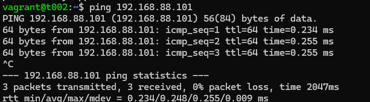

# h2 Infra as code 7.11.2024 14:50-18:20, 11.11.2024 11:30-13:00, 17:30-
Tämä on palvelinten hallinta -kurssin toisen viikkotehtävän raportti. Raportti koostuu kuudesta tehtävästä (x-i) ja niiden ratkaisuista. Tehtävänanto löytyy https://terokarvinen.com/palvelinten-hallinta/#h2-infra-as-code. Työskentely tapahtuu kotona omalla kannettavalla, joka on kevyeen pelikäyttöön tarkoitettu. Käyttöjärjestelmänä Windows 11 Home, ja tehtävien tekemiseen VirtualBoxin kautta asennettu Linux Debian Bookworm. Vagrant tehtäviin käytössä Windowsin komentorivi.

## x) Lue ja tiivistä
Raportissa on tiivistetty artikkelien keskeiset sisällöt

### Two Machine Virtual Network With Debian 11 Bullseye and Vagrant
- Artikkelissa on ohjeet kahden virtuaalikoneen asentamiseen ja yhteydenottoon Vagrantilla
- Jokaiselle Vagrantille perustetaan oma "projekti" hakemistoon omalla nimellään, ja sinne luodaan Vagrant-tiedosto, joka sisältää virtuaalikoneiden starttitiedot
- Vagrant toimii käytännössä kaikilla Host-OS:llä
(Karvinen, T. 2021. https://terokarvinen.com/2021/two-machine-virtual-network-with-debian-11-bullseye-and-vagrant/)

### Salt Quickstart – Salt Stack Master and Slave on Ubuntu Linux
- Tiivistelmä ja lähdetiedot https://github.com/guikka4/palvelintenhallinta/blob/main/h1/h1_Viisikko.md

### Hello Salt Infra-as-Code
- Artikkelissa on kerrottu esimerkillä infraa koodina- idea Saltin avulla
- Jokaiseen Saltin "moduuliin" on syytä luoda oma hakemistokansionsa, josta eri tilakomentoja ajetaan
(Karvinen, T. 2024. https://terokarvinen.com/2024/hello-salt-infra-as-code/)

### Salt Vagrant - automatically provision one master and two slaves
- Saltin hakemistoon luotuun moduulikansioon luodaan init.sls tiedosto. Sillä ajetaan moduulikohtaiset tilat
- Saltin hakemiston "ylätasolla", eli moduulikansioiden yläpuolelle luodaan top.sls tiedosto. Siihen määritellään, mitkä orjat tekevät mitäkin.
(Karvinen, T. 2023. https://terokarvinen.com/2023/salt-vagrant/#infra-as-code---your-wishes-as-a-text-file)

### Salt Overview (YAML)
- YAML on koodikieli, jota käytetään Saltissa. Se ikäänkuin "muuntaa" koodinsa python-kielelle
- YAML:ssa oma kirjoitustyylinsä, ja esimerkiksi tabulaattoria ei käytetä ollenkaan. Koodi toimii avain-arvo -parina
- YAML:ssa on kolme pääelementtiä: mappaus (avain : arvo), listat ja hakemistot. Kaikki toimivat kylläkin avain : arvo periaatteella.
- YAML on hyvin jäsennelty, lohkomainen koodauskieli. Siinä sisennetään jokainen oma "lohkonsa". Yleinen sisennystapa on 2 välilyöntiä.
(Saltproject. https://docs.saltproject.io/salt/user-guide/en/latest/topics/overview.html#rules-of-yaml)

## a) Hello Vagrant! 7.11.2024 15:40
Vagrant on asennettu aiemmin hostOS:lle. Komento Powershellistä
`vagrant --version`

## b) Linux Vagrant 7.11.2024 15:40-15:55
Tehtävänosassa luodaan Vagrantilla uusi virtuaalikone
`mkdir firstbookworm` uusi kansio virtuaalikoneprojektia ja vagrantfileä varten. Olen siis HostOS:n omassa käyttäjähakemistossa
`vagrant init debian/bookworm64` lataa uusimman debian-version imagen luotuun kansioon

    vagrant up
luodaan uusi kone. Tässä kohtaa powershellissä näkyy tekstiä, kun uuden koneen asennus etenee.
Kuvassa näkyvissä VirtualBoxin näkymä, jossa uusi kone näkyvissä.

Alla olevilla komennoilla nähdään virtuaalikoneen status, tässä tapauksessa running, sekä pysäytetään kone ja poistetaan se kaikkine tiedostoineen. Lähde `vagrant help`

    vagrant status
    vagrant halt
    vagrant destroy

## c) Kaksin kaunihimpi 7.11.2024 16:00-16:30
Tehtävänosassa tehdään kahden virtuaalikoneen verkko. Lopuksi pingataan, jotta nähdään niiden olevan verkossa
Teen ensin uudet virtuaalikoneet. Tehtävässä käytän apuna https://terokarvinen.com/2021/two-machine-virtual-network-with-debian-11-bullseye-and-vagrant/ artikkelia. Työskentelen HostOS:llä. Luon kansion kotihakemistooni, siirryn sinne, lataan sinne vagrantfilen.

    mkdir kaksikonetta
    cd kaksikonetta
    vagrant init debian/bookworm64

Tämän jälkeen avaan Vagrantfilen ja kopioin siihen artikkelissa olevan koodin. Powershell-komennolla `notepad vagrantfile` pystytään avaamaan tekstieditori, johon koodin voi kopioida. `vagrant status` voidaan testata jälleen, että koneet ovat pystyssä.

Seuraavaksi virtuaalikoneiden asennus ja käynnistys

    vagrant up

Yhteyden tarkistus. Menen ensin sisälle t001 koneeseen ssh:lla, ja pingaan sieltä t002 konetta, jonka jälkeen ssh sulkeminen. Sama toisin päin. IP-osoitteet ovat koodista, joka kopioitiin vagrantfileen. IP osoitteen saisi tietoon myös `hostname -I` komennolla

    vagrant ssh t001
    ping 192.168.88.102
    exit

    vagrant ssh t002
    ping 192.168.88.101
    exit

 

## d) Herra-orja verkossa 7.11.2024 17:10-18:20
Tehtävässä teen herra-orja -verkon näille kahdelle äskön luodulle virtuaalikoneelle. Apuna käytän Tero Karvisen artikkelia https://terokarvinen.com/2018/salt-quickstart-salt-stack-master-and-slave-on-ubuntu-linux.
Aloitetaan tekemällä t001 koneesta master. Avataan yllä kuvatulla tavalla ssh yhteys t001 koneeseen, jonka jälkeen masterin asennus. Tämän jälkeen kirjaudutaan ssh:lla t002 koneelle, ja tehdään siitä minion. Sen jälkeen kirjataan masterin tiedot minionille, ja hyväksytään avain. Lopuksi testataan että yhteys pelittää komentamalla orjaa.

    vagrant ssh t001
    sudo apt-get install -y salt-master
    hostname -I # palautuvaa IP-osoitetta tarvitaan minionille

Tämän jälkeen https://terokarvinen.com/palvelinten-hallinta/#h1-viisikko tehtävän vinkeissä ollut koodin hakemiston luomiseksi

    sudo mkdir -p /etc/apt/keyrings
    sudo curl -fsSL -o /etc/apt/keyrings/salt-archive-keyring-2023.gpg https://repo.saltproject.io/salt/py3/debian/12/amd64/SALT-PROJECT-GPG-PUBKEY-2023.gpg

Tässä kohtaa tulee virheilmoitus `sudo: curl: command not found`. Etsiskelin virheen syytä, ja näyttäisi siltä, että minulla ei ole curlia asennettuna tähän koneeseen (https://www.tecmint.com/bash-curl-command-not-found-error/). Tarkistin vielä `curl --version`, ja saan virheen "-bash: cuel: command not found". Tämä vahvistaa aavistukseni.
Asennetaan curl ja jatketaan.

    sudo apt-get install curl
    sudo curl -fsSL -o /etc/apt/keyrings/salt-archive-keyring-2023.gpg https://repo.saltproject.io/salt/py3/debian/12/amd64/SALT-PROJECT-GPG-PUBKEY-2023.gpg
    echo "deb [signed-by=/etc/apt/keyrings/salt-archive-keyring-2023.gpg arch=amd64] https://repo.saltproject.io/salt/py3/debian/12/amd64/latest bookworm main" | sudo tee /etc/apt/sources.list.d/salt.list

Tässä kohtaa saan virheilmoituksen `curl: (6) Could not resolve host: repo.saltproject.io` Eli homma tyssää. Kokeilin samat toimet minion -koneeseen, siellä sama juttu.
Yritys korjata tilanne
`sudo apt-get -y dist-upgrade` päivitellään. Ei auta
`sudo systemctl enable salt-minion` "käynnistellään". Virheeksi tulee "Failed to enable unit: Unit file salt-minion.service does not exist"
`sudo systemctl restart salt-minion` Virheenä "Failed to restart salt-minion.service: Unit salt-minion.service not found."

Eli pakettia ei ole asennettu. Sitten uudestaan asennusyritys
`sudo apt-get -y install salt-minion` ja saan seuraavan virheen

    Note, selecting 'open-vm-tools-salt-minion' for regex 'salt.minion'
    Some packages could not be installed. This may mean that you have
    requested an impossible situation or if you are using the unstable
    distribution that some required packages have not yet been created
    or been moved out of Incoming.
    The following information may help to resolve the situation:

    The following packages have unmet dependencies:
    open-vm-tools-salt-minion : Depends: open-vm-tools (= 2:12.2.0-1+deb12u2~bpo11+1) but 2:11.2.5-2+deb11u3 is to be installed
    E: Unable to correct problems, you have held broken packages.

Ymmärrän sen verran lontoota, että tässä kohtaa ei jotkun asennellut versiot jostain kohtaa (huom viimeinen kappale virheilmoituksessa). Kokeillaan vielä paria juttua.
`apt-cache policy open-vm-tools-desktop open-vm-tools` kertoo virheessä olevien open-vm-toolsien puuttuvan. https://askubuntu.com/questions/1232829/ubuntu-18-04-open-vm-tools-broken-package löytyy käytetty komento.

Kokeillaan asentaa (https://docs.vmware.com/en/VMware-Tools/12.4.0/com.vmware.vsphere.vmwaretools.doc/GUID-C48E1F14-240D-4DD1-8D4C-25B6EBE4BB0F.html) ja sen jälkeen uudestaan katsotaan vm-toolsien asentuminen
    sudo apt-get install open-vm-tools
    apt-cache policy open-vm-tools-desktop open-vm-tools

Uusi kokeilu salt komennoilla. Ei toimi, salt-minionia asentaessa tulee edelleen virhe "Unable to locate package salt-minion". Nyt loppui tietotaito ja ymmärrys.

### Homma jatkuu d. kohdasta 11.11.2024 11:30-13:00
Ensimmäisen kerran uutta yritystä. Poistin Vagrantilla luodut koneet, tein uudet. Kokeilin kaikki aiemmin tehdyt vaiheet uudelleen. Ei toimi. Poistan koneet, yritän uudestaan. Ainakin Vagrantin käyttöön tulee kivaa kokemusta. Luovutan klo 13.

### Homma jatkuu d. kohdasta 11.11.2024 17:30
Uudella innolla homman kimppuun. Lähtötilanne: Ei tehtyjä virtuaalikoneita. Onnistuin seuraavien vaiheiden avulla asentamaan vihdoin viimein salt-masterin ja salt-minionin Vagrantilla luoduille kahdelle koneelle, jotka ovat tässäkin t001 (tuleva master) ja t002 (tuleva minion). Ohjeet saltin hakemiston luontiin ovat vanhentuneet, kehittäjältä on tullut uudet ohjeet (https://saltproject.io/blog/salt-project-package-repo-migration-and-guidance/). Alla käyty vaiheittain asennusvaiheet. Vagrantfile on sama kuin ennen, muutin vain kohtaa, jossa on `config.vm.box = "debian/bullseye64"` -> `config.vm.box = "debian/bookworm64"`.

Kiinnitin eniten huomiota toimimattomuudessa tällä kertaa siihen, että hakemiston luontiin käytettävä repo.saltproject.io ei vastannut curlilla. Aikani googlattuani virhettä `curl: (6) Could not resolve host: repo.saltproject.io`, löysin sitten artikkelin jossa oli uudet ohjeet.

    vagrant up
    vagrant ssh t001
    
    sudo apt-get update
    sudo apt-get -y dist-upgrade

Sitten hakemiston luonti, ja uudet komennot yllä mainitusta lähteestä.

    sudo mkdir -p /etc/apt/keyrings
    sudo curl -fsSL https://packages.broadcom.com/artifactory/api/security/keypair/SaltProjectKey/public | sudo tee /etc/apt/keyrings/salt-archive-keyring-2023.pgp
    echo "deb [signed-by=/etc/apt/keyrings/salt-archive-keyring-2023.pgp arch=amd64] https://packages.broadcom.com/artifactory/saltproject-deb/ stable main" | sudo tee /etc/apt/sources.list.d/salt.list

Tämän jälkeen onnistui asennus salt-masterille

    sudo apt-get update
    sudo apt-get install salt-master
    
Suljin ssh yhteyden `exit` ja toistin samat toimenpiteet t002 koneelle, mutta asensin salt-minionin.

## Lähteet
- https://askubuntu.com/questions/1232829/ubuntu-18-04-open-vm-tools-broken-package. Luettavissa 7.11.2024
  https://docs.vmware.com/en/VMware-Tools/12.4.0/com.vmware.vsphere.vmwaretools.doc/GUID-C48E1F14-240D-4DD1-8D4C-25B6EBE4BB0F.html. Luettavissa 7.11.2024
- Hartikainen, P. 2024. https://github.com/guikka4/palvelintenhallinta/blob/main/h1/h1_Viisikko.md. Luettavissa 7.11.2024
- Karvinen, T. 2021. https://terokarvinen.com/2021/two-machine-virtual-network-with-debian-11-bullseye-and-vagrant/. Luettavissa 7.11.2024
- Karvinen, T. 2023. https://terokarvinen.com/2023/salt-vagrant/#infra-as-code---your-wishes-as-a-text-file. Luettavissa 7.11.2024
- Karvinen, T. 2024. https://terokarvinen.com/2024/hello-salt-infra-as-code/.Luettavissa 7.11.2024
- Saltproject. https://docs.saltproject.io/salt/user-guide/en/latest/topics/overview.html#rules-of-yaml. Luettavissa 7.11.2024
- Saltproject. UUDET HAKEMISTO-OHJEET. https://saltproject.io/blog/salt-project-package-repo-migration-and-guidance/. Luettavissa 11.11.2024
