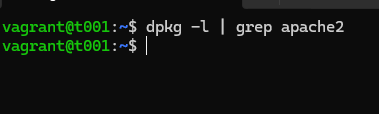
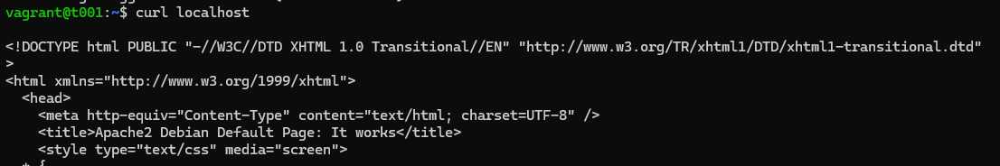
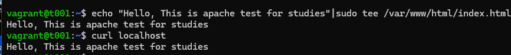
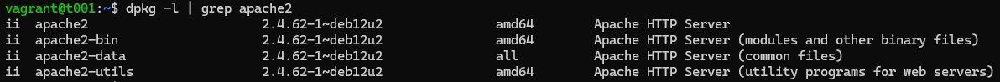
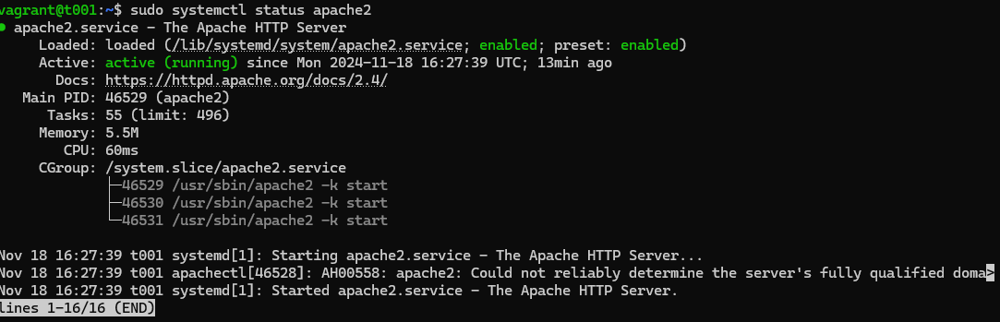
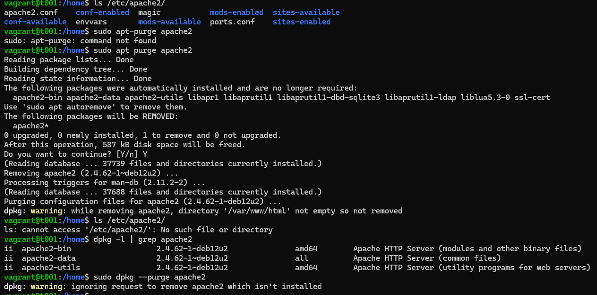
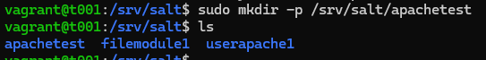

# h3 Demoni 18.11.2024 18:15-
Tämä on palvelinten hallinta -kurssin kolmannen viikkotehtävän raportti. Raportti koostuu viidestä tehtävästä (x-d) ja niiden ratkaisuista. Tehtävänanto löytyy https://terokarvinen.com/palvelinten-hallinta/#h3-demoni. Työskentely tapahtuu kotona omalla kannettavalla, joka on kevyeen pelikäyttöön tarkoitettu. Käyttöjärjestelmänä Windows 11 Home, ja tehtävien tekemiseen VirtualBoxin kautta asennettu Linux Debian Bookworm, jota operoin Windowsin komentoriviltä (vagrant ssh).

## x) Lue ja tiivistä
Raportissa on tiivistettynä artikkelien keskeisin sisältö

### Pkg-File-Service – Control Daemons with Salt – Change SSH Server Port
- Artikkeli esittelee yksinkertaisen tavan SSH-palvelinportin vaihtamiseksi Saltin tilafunktiota käyttäen
- pkg-file-service on yleinen kaava toimia keskitetyssä hallinnassa. Se sisältää asennuksen, asetustiedoston muuttamisen sekä demonin uudelleenkäynnistyksen asetusten vahvistamiseksi
(Karvinen, T. 2018. https://terokarvinen.com/2018/04/03/pkg-file-service-control-daemons-with-salt-change-ssh-server-port/?fromSearch=karvinen%20salt%20ssh)

### Salt modulit pkg, file, service
- pkg
  - pkg-modulia käytetään lataamaan paketteja salt-minion ryhmälle
  - `pkg.installed` varmistaa, että paketti on asennettu ja oikealla versiolla (mikäli se on määritelty)
  - määrityksiä esimerkiksi repojen lataamiseenkin voi tehdä
  - `pkg.purged` poistaa paketin asennuksen ja asetustiedostot, mikäli niitä löytyy
(`sudo salt-call --local sys.state_doc pkg`) 
- file
  - file-modulia käytetään tiedostojen hallintaan
  - `file.managed` mahdollistaa tiedoston lataamisen masterilta minioneille, mikäli tiedostoa ei ole vielä olemassa tai siihen on tullut muutoksia
  - `file.absent` varmistaa, että tiedosto tai hakemisto on poissa. Jos se on olemassa, komento poistaa sen
  - `file.symlink` tätä en ihan ymmärrä...
(`sudo salt-call --local sys.state_doc file`)
- service
  - servicellä tarkoitetaan demonien, palveluiden, käynnissäoloa
    - `service.running` varmistaa demonin käynnissäolon. Käynnistää mikäli on sammuksissa
    - `service.dead` varmistaa demonin sammumisen. Sammuttaa mikäli se on vielä käynnissä
    - `service.enabled` varmistaa, että demoni on käytössä/saatavilla uudelleenkäynnistyksen jälkeen
(`sudo salt-call --local sys.state_doc service`)

## a) Apache easy mode 18.11.2024 18:15-
Tehtävässä asennetaan Apache, korvataan testisivu sekä varmistutaan demonin käynnistymisestä.  Ensin asennus tehdään käsin, ja sen jälkeen automatisoidaan.
Aloitetaan näyttämällä `dpkg -l | grep apache2` komennolla, että apachea ei ole vielä asennettu.  Sen jälkeen päivitykset, lataan paketin, korvaan testisivun sekä tarkistan palvelimen käynnissäolon. Vinkit tehtävänannossa, sekä https://terokarvinen.com/2018/04/10/name-based-virtual-hosts-on-apache-multiple-websites-to-single-ip-address/.

    sudo apt-get update

    sudo apt-get -y install apache2

    curl localhost

curl näyttää tällä hetkellä apache:n oletus aloitussivun, josta curlin näkymä (testisivu on pitkä, kuvakaappauksessa näkyy, että se on apachen sivu). Nyt korvaan etusivulle lukemaan "Hello, This is apache test for studies".

    echo "Hello, This is apache test for studies"|sudo tee /var/www/html/index.html

    curl localhost

Tällä hetkellä olemme tilanteessa, jossa apache2 palvelin on asennettuna, sekä etusivu korvattuna. Seuraavassa kuvakaappaukset, jossa näkyy osoitus siitä, että apache2 palvelin on asennettu ja käynnissä. Demonia ei tarvinnut potkia erikseen käyntiin, vaan se käynnistyi jo aiemmin.

    dpkg -l | grep apache2
    
    sudo systemctl status apache2

 

poistetaan apache2 paketti käyttämällä purge komentoa. Se poistaa myös asetustiedostot (remove ei poista niitä, vaan pelkän asennuksen). Tsekataan vielä, että pakettia tai hakemistoja ei löydy

    ls /etc/apache2/
    
    sudo apt purge apache2

    ls /etc/apache2/

    dpkg -l | grep apache2

Viimeisin komento näytti, että apache2 paketti olisi asennettuna. Mutta onkohan niin, että tämä komento näyttää kaikki paketit, jotka ovat olleet joskus asennettuna? Kokeilin vielä `sudo dpkg --purge apache2` komentoa, ja tulos oli se, että pakettia ei enää löydy.

ja aloitetaan automatisointi. Olemme siis tilanteessa, jossa apache2 demonia ei ole asennettuna sekä asetustiedostot puuttuvat. Tehdään salt moduuli (apachetest), jonne tehdään pkg-file-service mallinen tila. Ajetaan komento saltilla paikallisesti, ja testataan lopputulos. Vinkit https://terokarvinen.com/2018/04/03/pkg-file-service-control-daemons-with-salt-change-ssh-server-port/?fromSearch=karvinen%20salt%20ssh.

    sudo mkdir -p /srv/salt/apachetest
    cd /srv/salt/apachetest

    sudoedit init.sls

    apache2:
      pkg.installed

    /etc/apache2/sites-available/test.conf:
      file.managed:
        - source: "salt://apachetest/test.conf"
        
    apache2.service:
      service.running

Tämän jälkeen ajokomento, ja tulokset kuvakaappauksessa

    sudo salt-call --local -l debug state.apply apachetest

tähän h3_8
Luulisin, että tuossa source -polussa on jotain väärin. Errorista päätellen. Muutetaan muotoon `salt://apache/test.conf` ja kokeillaan uudelleen

    sudo salt-call --local -l debug state.apply apachetest

Tulos on sama kuin edellisessä kuvassa. Luodaan test.conf tiedosto myöhemmässä vaiheessa. Nyt kokeillaan että apache on asentunut ja käynnissä, sekä korvataan etusivu.

    sudo systemctl status apache2

    curl localhost

    echo "Hello, This is a second test with sls"|sudo tee /var/www/html/index.html

    curl localhost

tähän h3_9

## Lähteet
- Karvinen, T. 2018. Name Based Virtual Hosts on Apache. https://terokarvinen.com/2018/04/10/name-based-virtual-hosts-on-apache-multiple-websites-to-single-ip-address/. Luettavissa 18.11.2024
- Karvinen, T. 2018. pkg-file-service. https://terokarvinen.com/2018/04/03/pkg-file-service-control-daemons-with-salt-change-ssh-server-port/?fromSearch=karvinen%20salt%20ssh. Luettavissa 18.11.2024
- Karvinen, T. 2024. Tehtävänanto. https://terokarvinen.com/palvelinten-hallinta/#h3-demoni. Luettavissa 14.11.2024
- Salt-tilojen ohjeet `sudo salt-call --local sys.state_doc <module>`
