# h3 Demoni 18.11.2024 18:15-20:30; 19.11.2024 19:10-
Tämä on palvelinten hallinta -kurssin kolmannen viikkotehtävän raportti. Raportti koostuu viidestä tehtävästä (x-d) ja niiden ratkaisuista. Tehtävänanto löytyy https://terokarvinen.com/palvelinten-hallinta/#h3-demoni. Työskentely tapahtuu kotona omalla kannettavalla, joka on kevyeen pelikäyttöön tarkoitettu. Käyttöjärjestelmänä Windows 11 Home, ja tehtävien tekemiseen VirtualBoxin kautta asennettu Linux Debian Bookworm, jota operoin Windowsin komentoriviltä (vagrant ssh).

## x) Lue ja tiivistä
Raportissa on tiivistettynä artikkelien keskeisin sisältö

### Pkg-File-Service – Control Daemons with Salt – Change SSH Server Port
- Artikkeli esittelee yksinkertaisen tavan SSH-palvelinportin vaihtamiseksi Saltin tilafunktiota käyttäen
- pkg-file-service on yleinen kaava toimia keskitetyssä hallinnassa. Se sisältää asennuksen, asetustiedoston muuttamisen sekä demonin uudelleenkäynnistyksen asetusten vahvistamiseksi
(Karvinen, T. 2018. https://terokarvinen.com/2018/04/03/pkg-file-service-control-daemons-with-salt-change-ssh-server-port/?fromSearch=karvinen%20salt%20ssh)

### Salt modulit pkg, file, service
- pkg
  - pkg-modulia käytetään lataamaan paketteja salt-minion ryhmälle
  - `pkg.installed` varmistaa, että paketti on asennettu ja oikealla versiolla (mikäli se on määritelty)
  - määrityksiä esimerkiksi repojen lataamiseenkin voi tehdä
  - `pkg.purged` poistaa paketin asennuksen ja asetustiedostot, mikäli niitä löytyy
(`sudo salt-call --local sys.state_doc pkg`) 
- file
  - file-modulia käytetään tiedostojen hallintaan
  - `file.managed` mahdollistaa tiedoston lataamisen masterilta minioneille, mikäli tiedostoa ei ole vielä olemassa tai siihen on tullut muutoksia
  - `file.absent` varmistaa, että tiedosto tai hakemisto on poissa. Jos se on olemassa, komento poistaa sen
  - `file.symlink` tätä en ihan ymmärrä...
(`sudo salt-call --local sys.state_doc file`)
- service
  - servicellä tarkoitetaan demonien, palveluiden, käynnissäoloa
    - `service.running` varmistaa demonin käynnissäolon. Käynnistää mikäli on sammuksissa
    - `service.dead` varmistaa demonin sammumisen. Sammuttaa mikäli se on vielä käynnissä
    - `service.enabled` varmistaa, että demoni on käytössä/saatavilla uudelleenkäynnistyksen jälkeen
(`sudo salt-call --local sys.state_doc service`)

## a) Apache easy mode 18.11.2024 18:15-19:30
Tehtävässä asennetaan Apache, korvataan testisivu sekä varmistutaan demonin käynnistymisestä.  Ensin asennus tehdään käsin, ja sen jälkeen automatisoidaan.
Aloitetaan näyttämällä `dpkg -l | grep apache2` komennolla, että apachea ei ole vielä asennettu.  Sen jälkeen päivitykset, lataan paketin, korvaan testisivun sekä tarkistan palvelimen käynnissäolon. Vinkit tehtävänannossa, sekä https://terokarvinen.com/2018/04/10/name-based-virtual-hosts-on-apache-multiple-websites-to-single-ip-address/.

    sudo apt-get update

    sudo apt-get -y install apache2

    curl localhost

curl näyttää tällä hetkellä apache:n oletus aloitussivun, josta curlin näkymä (testisivu on pitkä, kuvakaappauksessa näkyy, että se on apachen sivu). Nyt korvaan etusivulle lukemaan "Hello, This is apache test for studies".

    echo "Hello, This is apache test for studies"|sudo tee /var/www/html/index.html

    curl localhost

Tällä hetkellä olemme tilanteessa, jossa apache2 palvelin on asennettuna, sekä etusivu korvattuna. Seuraavassa kuvakaappaukset, jossa näkyy osoitus siitä, että apache2 palvelin on asennettu ja käynnissä. Demonia ei tarvinnut potkia erikseen käyntiin, vaan se käynnistyi jo aiemmin.

    dpkg -l | grep apache2
    
    sudo systemctl status apache2

 

poistetaan apache2 paketti käyttämällä purge komentoa. Se poistaa myös asetustiedostot (remove ei poista niitä, vaan pelkän asennuksen). Tsekataan vielä, että pakettia tai hakemistoja ei löydy

    ls /etc/apache2/
    
    sudo apt purge apache2

    ls /etc/apache2/

    dpkg -l | grep apache2

Viimeisin komento näytti, että apache2 paketti olisi asennettuna. Mutta onkohan niin, että tämä komento näyttää kaikki paketit, jotka ovat olleet joskus asennettuna? Kokeilin vielä `sudo dpkg --purge apache2` komentoa, ja tulos oli se, että pakettia ei enää löydy.

ja aloitetaan automatisointi. Olemme siis tilanteessa, jossa apache2 demonia ei ole asennettuna sekä asetustiedostot puuttuvat. Tehdään salt moduuli (apachetest), jonne tehdään pkg-file-service mallinen tila. Ajetaan komento saltilla paikallisesti, ja testataan lopputulos. Vinkit https://terokarvinen.com/2018/04/03/pkg-file-service-control-daemons-with-salt-change-ssh-server-port/?fromSearch=karvinen%20salt%20ssh.

    sudo mkdir -p /srv/salt/apachetest
    cd /srv/salt/apachetest

    sudoedit init.sls

    apache2:
      pkg.installed

    /etc/apache2/sites-available/test.conf:
      file.managed:
        - source: "salt://apachetest/test.conf"
        
    apache2.service:
      service.running

Tämän jälkeen ajokomento, ja tulokset kuvakaappauksessa

    sudo salt-call --local -l debug state.apply apachetest

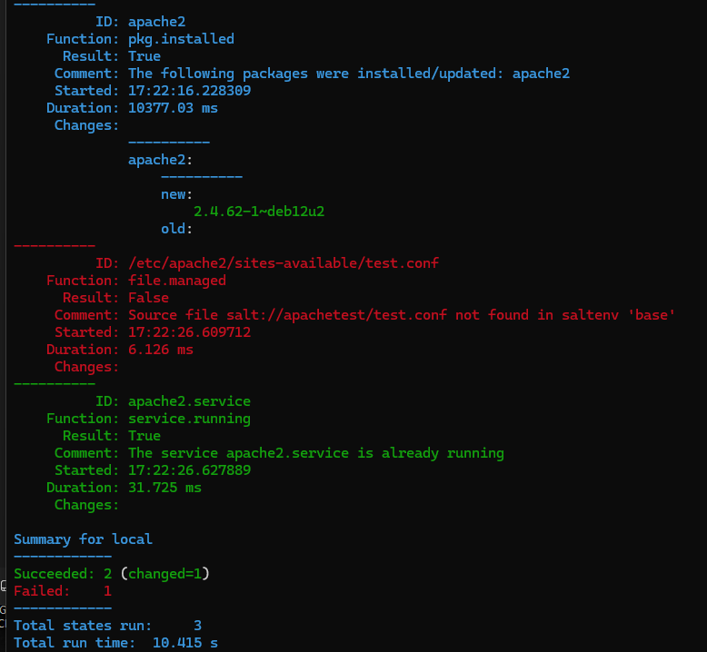
Luulisin, että tuossa source -polussa on jotain väärin. Errorista päätellen. Muutetaan muotoon `salt://apache/test.conf` ja kokeillaan uudelleen

    sudo salt-call --local -l debug state.apply apachetest

Tulos on sama kuin edellisessä kuvassa. Luulisin, että tuo test.conf tiedosto, mikä tuohon polkuun on mainittu, pitäisi tehdä tuonne moduulikansioon sekä osoittaa sourcella siihen. Luodaan test.conf tiedosto myöhemmässä vaiheessa. Nyt kokeillaan että apache on asentunut ja käynnissä, sekä korvataan etusivu.

    sudo systemctl status apache2

    curl localhost

    echo "Hello, This is a second test with sls"|sudo tee /var/www/html/index.html

    curl localhost

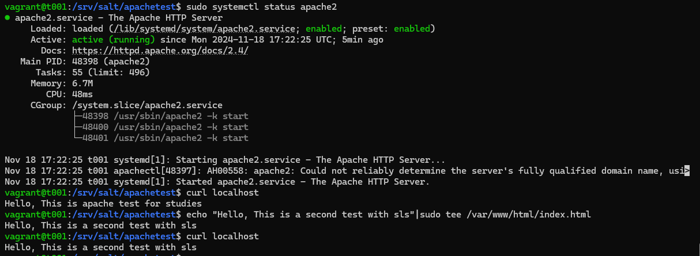

## b) SSHouto 18.11.2024 19:50-20:30
Tehtävässä lisätään uusi portti, jota SSH kuuntelee. Vinkit https://terokarvinen.com/2018/04/03/pkg-file-service-control-daemons-with-salt-change-ssh-server-port/?fromSearch=karvinen%20salt%20ssh.

SSH demoni löytyy jo valmiina, joten muokataan ensin sshd_config tiedostoa ja lisätään portti 8800 sinne.

    sudoedit /etc/ssh/sshd_config

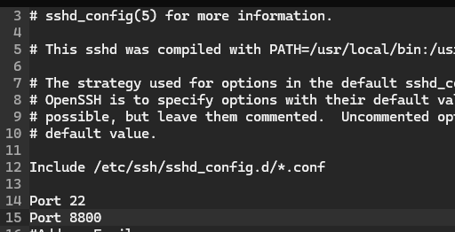

Luodaan ssh moduulikansio, johon kopioin sshd konffitiedostosta kommenttikentättömät ja rivivälittömät tekstit `cat sshd_config | grep -v '^#' | grep -v '^$'` komennolla saan ne tulostettua komentoriville

    sudo mkdir -p /srv/salt/ssh/
    cd /srv/salt/ssh/

    sudoedit sshd_config

    kopioin tänne aiemmat

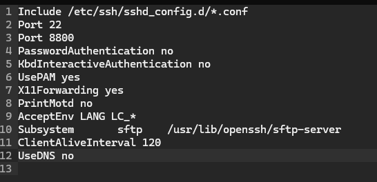

Tämän jälkeen teen moduulin sls tiedoston, johon pkg-file-service tulee.

    sudoedit init.sls

    ssh:
      pkg.installed

    /etc/ssh/sshd_config:
      file.managed:
        - source: "salt://ssh/sshd_config"

    ssh.service:
      service.running:
        - watch:
          - file: /etc/ssh/sshd_config

Ja kokeillaan

    sudo salt-call --local -l debug state.apply ssh

Lopputulos on toimiva. Alla kuvakaappaukset ensimmäisestä (2kuvaa, välissä pitkä liuta vihreää kommenttia joka karsittu pois), sekä idempotenssista.

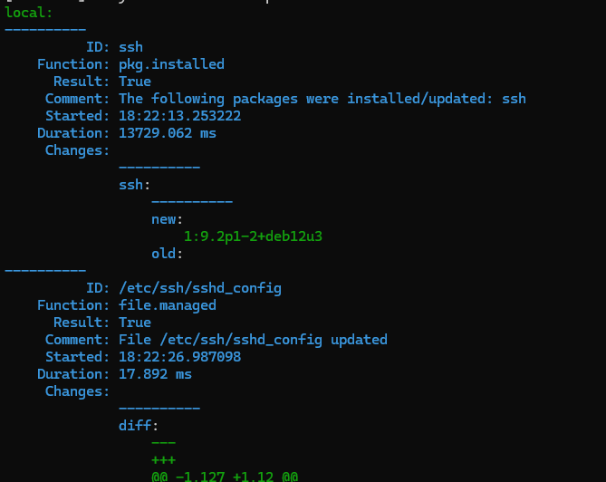 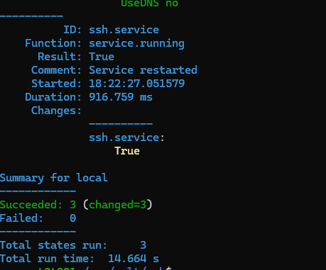

Tässä idempotenssi

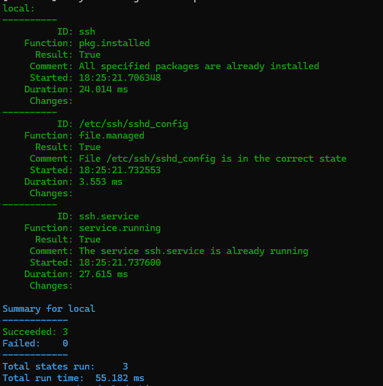

### UPDATE 19.11.2024 19:10-20:00
Kokeilin ajaa tämän saman moduulin orjille.

    sudo salt '*' -l debug state.apply ssh

Tämän kanssa oli hienoisia ongelmia, jotka johtuivat siitä, että salt-master ei pysynyt päällä ja connection timed out monesti. Tämä tuli todennettua `sudo systemctl status salt-master` komennolla. Kokeilin monta kertaa `sudo systemctl restart salt-master` komentoa, ja perään `sudo salt '*' test.ping` komentoa, kunnes minion t002 palautti arvon "true".

Tämän jälkeen uusi kokeilu `sudo salt '*' -l debug state.apply ssh` ja komento meni läpi. Ajoin vielä uudelleen, jotta sain idempotenssiin varmuuden. Jouduin jälleen käynnistelemään masteria uudelleen (kolmasti), ennenkuin komento meni läpi ja master pysyi käynnissä. Kolmas kuva näyttää netcatin porttikyselyn minionilta. Alimmassa kuvassa minionilla näkyvissä sshd_config.

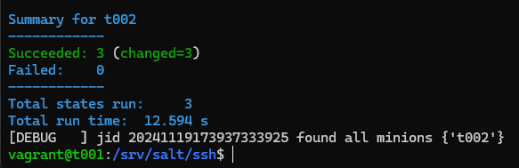

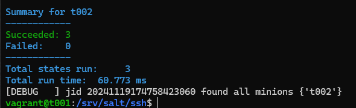

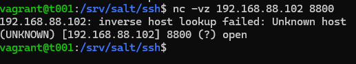

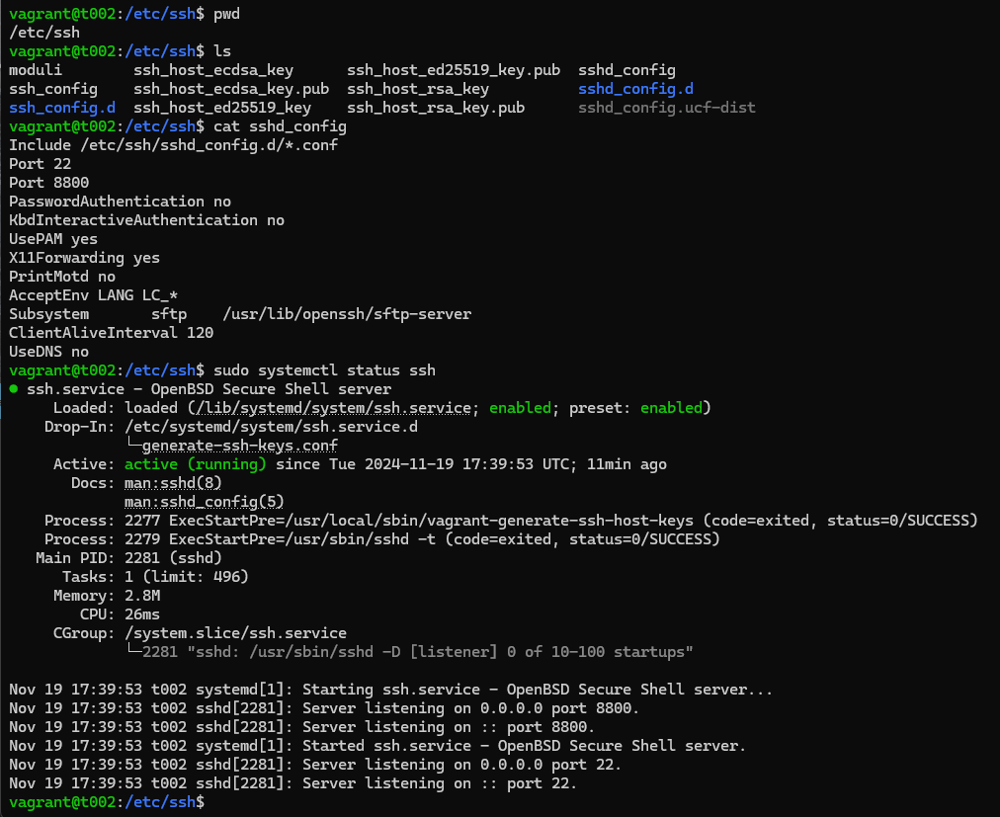

## c) Oma moduuli

## d) VirtualHost 19.11.2024 20:05-20:55

Tehtävässä on tarkoitus asentaa Apache tarjoamaan websivua localhostissa. Html-tiedoston tulee olla jonkun käyttäjän kotihakemistossa ja muokattavissa ilman sudoa. Vinkit https://terokarvinen.com/2018/name-based-virtual-hosts-on-apache-multiple-websites-to-single-ip-address/?fromSearch=virtual%20host.

Tarkoituksenani on laittaa Saltilla masterilta orjalle moduuli, joka sisältää apachen asennuksen, käyttäjän luonnin, sekä apachen asetustiedostot. Samalla korvaantuisi kotisivu localhostiin.
Aloitin tehtävän ottamalla orjakoneelta tämän hetkisen tilanteen. Apache2 on jo käynnissä, käyttäjät näkyvissä ja apachen testisivu näkyvissä localhostissa (kuvakaappaus alla).

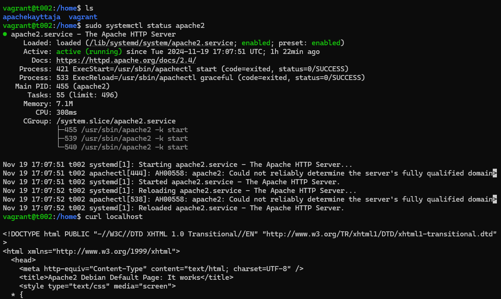

Tässä vaiheessa on luotuna jo moduuli `apachetest` jota olen käyttänyt aiemmin. Muokkasin sen init.sls tiedostoa, loin apachen konffitiedoston moduulikansioon, sekä tein index.html tiedoston samaiseen sijaintiin `/srv/salt/apachetest`, jotta moduulin kaikki tiedostot menisivät minionille jakoon.

### init.sls

    apacheuser:
      user.present

    /home/apacheuser/publicweb/index.html:
      file.managed:
        - source: "salt://apachetest/index.html"

    apache2:
      pkg.installed

    /etc/apache2/sites-available/test.conf:
      file.managed:
      - source: "salt://apachetest/test.conf"

    apache2.service:
      service.running

### index.html
    <!doctype html>

      <html lang="fi">
          <head>
          <meta charset="UTF-8">
          <title>Testing Apachedrop with Salt</title>
          </head>

    <body>

          <h1>Testing apachedrop with a new html page</h1>

          
Testataan ääkkösetkin.

          
Testissä dropattiin myös uusi käyttäjä ja hakemisto

    </body>
    </html>

### test.conf

    <VirtualHost *:80>
          ServerName apachetest.com
          ServerAlias www.apachetest.com

                  DocumentRoot /home/apacheuser/publicweb/
                  <Directory /home/apacheuser/publicweb/>

                          Require all granted

                  </Directory>
    </Virtualhost>

Tässä kohdassa on hyvä ajaa ja katsoa virheet

    sudo salt '*' -l debug state.apply apachetest

Jumitti, sekä master kaatui muutaman kerran. Kävi ilmi, että parent directory ei ole olemassa index.html filun luonnille orjakoneelle. Tästä on hyvä jatkaa seuraavana päivänä.

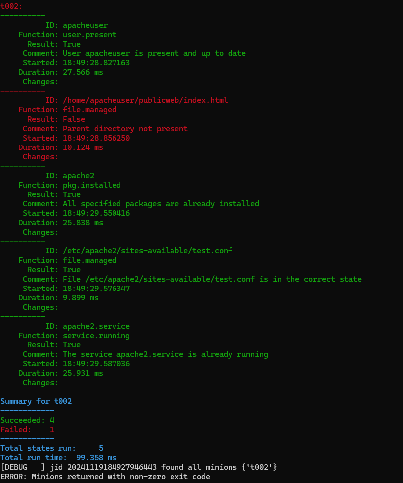

## Lähteet
- Karvinen, T. 2018. Name Based Virtual Hosts on Apache. https://terokarvinen.com/2018/04/10/name-based-virtual-hosts-on-apache-multiple-websites-to-single-ip-address/. Luettavissa 18.11.2024
- Karvinen, T. 2018. pkg-file-service. https://terokarvinen.com/2018/04/03/pkg-file-service-control-daemons-with-salt-change-ssh-server-port/?fromSearch=karvinen%20salt%20ssh. Luettavissa 18.11.2024
- Karvinen, T. 2024. Tehtävänanto. https://terokarvinen.com/palvelinten-hallinta/#h3-demoni. Luettavissa 14.11.2024
- Salt-tilojen ohjeet `sudo salt-call --local sys.state_doc <module>`
