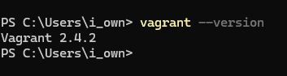
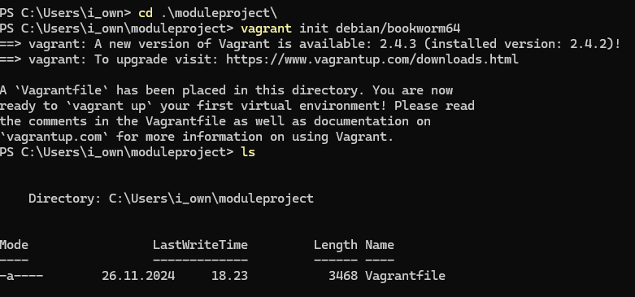
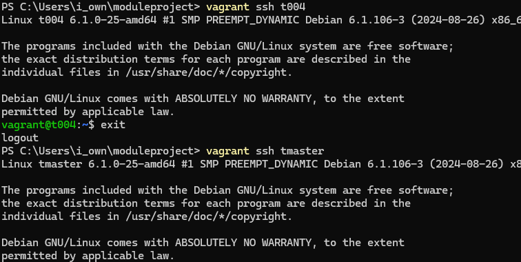
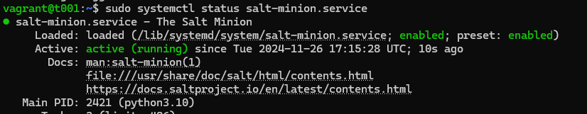
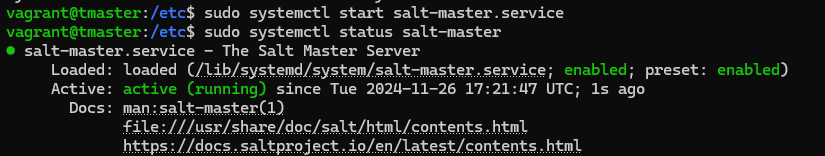
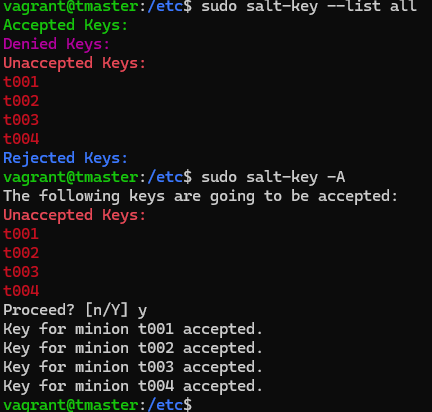

# h4 Puolikas
Tarkoituksenani on viritellä pieni virtuaaliympäristö, jossa luon Vagrantin avulla uusia virtuaalikoneita. Koneet käyttävät Debian 12 Bookwormia. Eri koneille asennellaan eri käyttöön tarkoitettavia palvelimia, sekä määritellään niille käyttäjät sekä käyttäjille kotihakemistot. Olin ajatellut asennettaville palvelinkoneille ainakin Apachea sekä PostgreSQL:ää. Kaikki asennukset sekä käyttäjien luonti tapahtuu käyttäen keskitetyn hallinnan ohjelmistoa, SaltStackia. Yhdestä virtuaalikoneesta tulee siis master, josta valutetaan käskyt minion koneille. Lisäksi jokaiselle virtuaalikoneelle luodaan vielä SSH-varayhteys määrittäen uusi avoin tcp portti.

Raportin kirjoittamisen alkuhetki on 26.11.2024 klo 17:15. Sisältö voi muuttua lennosta olennaisestikin, riippuen siitä, miten työ edistyy. Jokainen työvaihe on tarkoitus raportoida, kaikki toimet tehdä ensin käsin, jonka jälkeen automatisoida. Testeistä raportoidaan.

Raportin kirjoittamisessa käytän selainta HostOS:n puolella. HostOS on Windows 11, ja käytettävä rauta on kevyeen pelikäyttöön tarkoitettu kannettava tietokone. Vagrant ssh:n operoinnissa (virtuaalikoneet) käytän Windows PowerShelliä.

Tehtävänanto https://terokarvinen.com/palvelinten-hallinta/#h4-puolikas.

## HostOS
- Asus Tuf Gaming A15 FA506QM kannettava tietokone
- Käyttöjärjestelmä: Windows 11 Home
- Prosessori: AMD Ryzen 7 5800H, 8 ydintä 3200GHz
- Muisti: 16 Gt
- Näytönohjain NVIDIA GeForce RTX 3060 laptop, 6144Mt omalla muistilla

# Virtuaaliympäristö pystyyn 26.11.2024 18:10-19:20
Lähtötilanne: Vagrant on asennettuna HostOS:lle.

Tarkoitus on ladata Debian12 Bookworm kuva HostOS:n käyttäjäni hakemistoon ja luoda sinne Vagrantfile joka käynnistettäessä tekee viisi virtuaalikonetta, joista yksi toimii masterina ja neljä minionina. Vagrantfilessä on scripti, joka asentaa salt-master ja salt-minion demonit oikeille koneille. Vinkit https://terokarvinen.com/2023/salt-vagrant/?fromSearch=salt%20vagrant%20automati.

Alla olevat komennot tapahtuvat siis HostOS:n puolella.

    mkdir moduleproject
    cd moduleproject

    vagrant init debian/bookworm64

Vagrantfilessä on määriteltynä 4 minionkonetta t001-t004 sekä yksi master tmaster.

    # -*- mode: ruby -*-
    # vi: set ft=ruby :
    # Copyright 2014-2023 Tero Karvinen http://TeroKarvinen.com

    $minion = <<MINION
    sudo apt-get update
    sudo apt-get -qy install salt-minion
    echo "master: 192.168.12.3">/etc/salt/minion
    sudo service salt-minion restart
    echo "See also: https://terokarvinen.com/2023/salt-vagrant/"
    MINION

    $master = <<MASTER
    sudo apt-get update
    sudo apt-get -qy install salt-master
    echo "See also: https://terokarvinen.com/2023/salt-vagrant/"
    MASTER

    Vagrant.configure("2") do |config|
	    config.vm.box = "debian/bookworm64"

	    config.vm.define "t001" do |t001|
		    t001.vm.provision :shell, inline: $minion
		    t001.vm.network "private_network", ip: "192.168.12.100"
		    t001.vm.hostname = "t001"
	    end

	    config.vm.define "t002" do |t002|
		    t002.vm.provision :shell, inline: $minion
		    t002.vm.network "private_network", ip: "192.168.12.102"
		    t002.vm.hostname = "t002"
	    end

	    config.vm.define "t003" do |t003|
		    t003.vm.provision :shell, inline: $minion
		    t003.vm.network "private_network", ip: "192.168.12.104"
		    t003.vm.hostname = "t003"
	    end

	    config.vm.define "t004" do |t004|
	    	t004.vm.provision :shell, inline: $minion
	    	t004.vm.network "private_network", ip: "192.168.12.106"
		    t004.vm.hostname = "t004"
	    end

    	config.vm.define "tmaster", primary: true do |tmaster|
		    tmaster.vm.provision :shell, inline: $master
		    tmaster.vm.network "private_network", ip: "192.168.12.3"
		    tmaster.vm.hostname = "tmaster"
	    end
    end

Tämän jälkeen testi `vagrant up`. Salt-master ja Salt-minion ei asennu. Nyt muistin, että nykyään näiden asennus vaatii hakemiston asennuksen. Lisävinkit https://saltproject.io/blog/salt-project-package-repo-migration-and-guidance/. Joten poistin uudet koneet pysäyttämällä `vagrant halt` ja tuhoamalla ne `vagrant destroy` jonka jälkeen muokkasin vagrantfileä. Huomattakoon, että muuten virtuaalikoneiden asennus onnistui ensimmäiselläkin kerralla, ja ne olivat käynnissä. Kokeilin myös ssh yhteyttä t004 ja tmaster koneisiin, ja alla oleva todiste siitä, että toimi.

Siispä vagrantfilen kimppuun. Uudistettu scriptiosa alla.

    # -*- mode: ruby -*-
    # vi: set ft=ruby :
    # Copyright 2014-2023 Tero Karvinen http://TeroKarvinen.com

    $minion = <<MINION
    sudo apt-get update
    sudo apt-get -qy install curl
    sudo mkdir -p /etc/apt/keyrings
    sudo curl -fsSL https://packages.broadcom.com/artifactory/api/security/keypair/SaltProjectKey/public | sudo tee /etc/apt/keyrings/salt-archive-keyring-2023.pgp
    echo "deb [signed-by=/etc/apt/keyrings/salt-archive-keyring-2023.pgp arch=amd64] https://packages.broadcom.com/artifactory/saltproject-deb/ stable main" | sudo tee /etc/apt/sources.list.d/salt.list
    sudo apt-get -qy install salt-minion
    echo "master: 192.168.12.3">/etc/salt/minion
    sudo service salt-minion restart
    echo "See also: https://terokarvinen.com/2023/salt-vagrant/"
    MINION

    $master = <<MASTER
    sudo apt-get update
    sudo apt-get -qy install curl
    sudo mkdir -p /etc/apt/keyrings
    sudo curl -fsSL https://packages.broadcom.com/artifactory/api/security/keypair/SaltProjectKey/public | sudo tee /etc/apt/keyrings/salt-archive-keyring-2023.pgp
    echo "deb [signed-by=/etc/apt/keyrings/salt-archive-keyring-2023.pgp arch=amd64] https://packages.broadcom.com/artifactory/saltproject-deb/ stable main" | sudo tee /etc/apt/sources.list.d/salt.list
    sudo apt-get -qy install salt-master
    echo "See also: https://terokarvinen.com/2023/salt-vagrant/"
    MASTER

Salt minion tai master eivät vieläkään asennu. Hakemistot ovat kyllä asentuneet... Testasin käsin pakettien päivitykset sekä saltin asennuksen. Asennus toimi manuaalisesti. Tältä erää hyvä lopettaa scriptin nysvääminen ja siirtyä käsin asenteluun.

    sudo apt-get update
    sudo apt-get -y install salt-minion

Minioneilla tekemään osoitus masterille, koska scripti ei ole luonut tiedostoa eikä muokannut sitä

    sudoedit /etc/salt/minion

    master: 192.168.12.3

Toistin tämän kaikille minion koneille t001-t004. Jokaisen config filen muokkaamisen jälkeen demonin uudelleen käynnistys `sudo systemctl restart salt-minion`

Sitten masterilla avainten hyväksyntä. Ensin listaus että kaikki avainpyynnöt tulleet minioneilta, ja sitten hyväksyntä

    sudo salt-key --list all
    sudo salt-key -A

## Apache2

## PostgreSQL

## Työpöytä

## Lähteet
- Karvinen, T. 2023. Salt Vagrant - automatically provision one master and two slaves. https://terokarvinen.com/2023/salt-vagrant/?fromSearch=salt%20vagrant%20automati. Luettavissa 26.11.2024
- Karvinen, T. 2024. Tehtävänanto. https://terokarvinen.com/palvelinten-hallinta/#h4-puolikas. Luettavissa 26.11.2024
- Saltproject. Repository guidance. https://saltproject.io/blog/salt-project-package-repo-migration-and-guidance/. Luettavissa 26.11.2024
