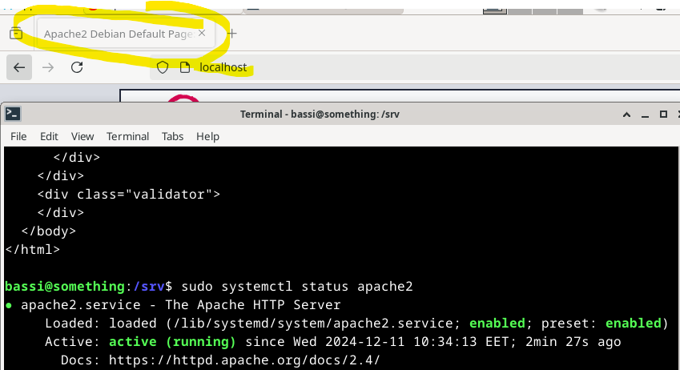
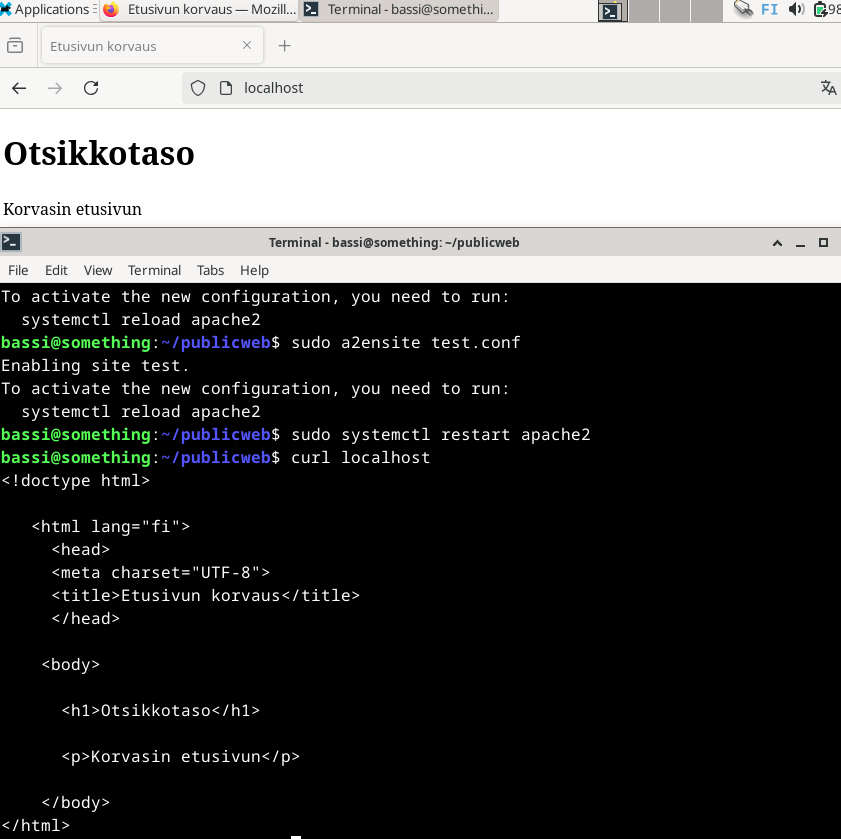
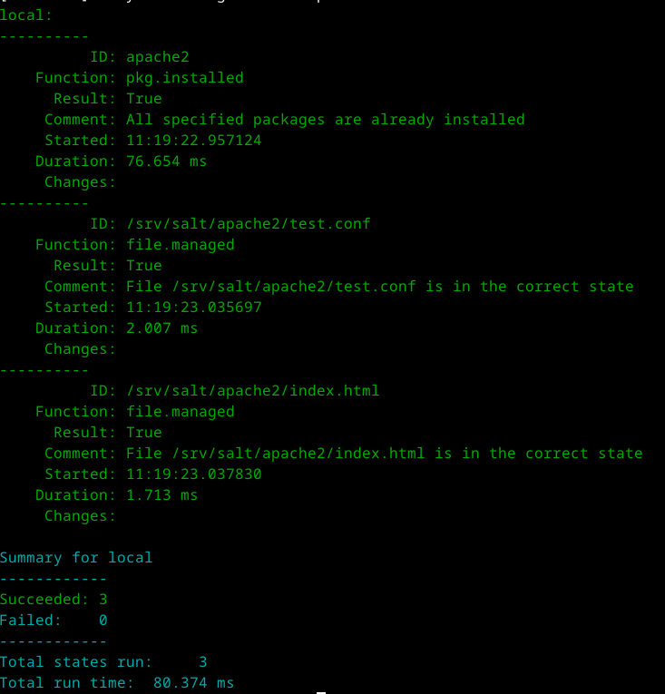
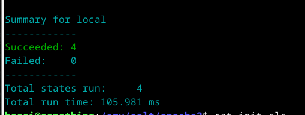
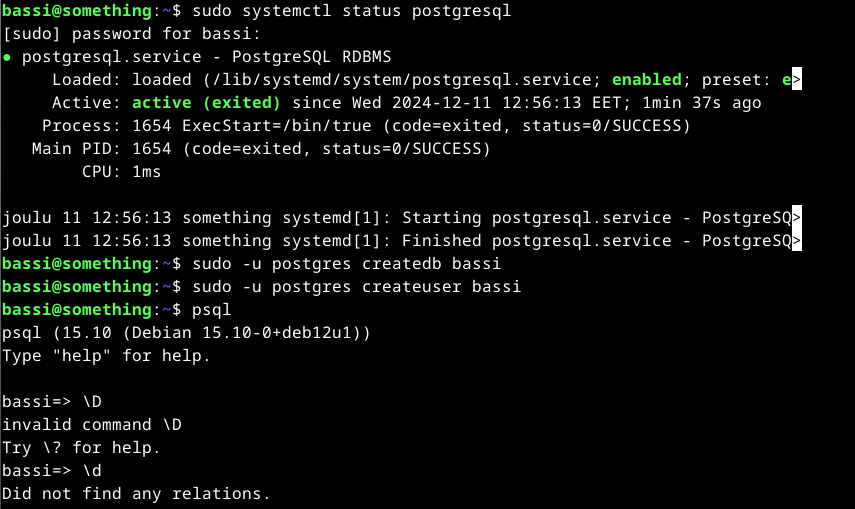
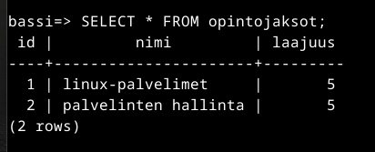
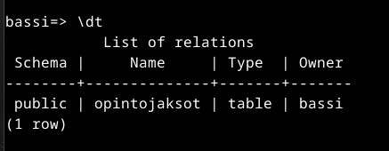

# h8 Bonus
Tämä raportti sisältää Palvelinten hallinta -kurssin (2024syksy) vapaaehtoiset tehtävät. Tehtävissä on lyhyet tehtävänkuvaukset, sekä linkit tehtävänantoihin.

Työskentely tapahtuu kotioloissa. HostOS on Windows 11 Home (64), joka pyörii kevyeen pelikäyttöön tarkoitetulla kannettavalla tietokoneella. GuestOS VirtualBox ja Debian12 Bookworm(64). 

## a) Vapaaehtoiset tehtävät
Tästä löytyy vapaaehtoiset Bonus-tehtävät

### h2 infra as a code: tehtävä i) Asenna ja konfiguroi Apache. 11.12.2024 10:25-11:00
Tehtävässä on tarkoitus asentaa Apache web-palvelin, ja korvata sen etusivu näyttämään web-sivua. Web-sivun tulee olla muokattavissa ilman sudo-oikeuksia.
[Tehtävänanto](https://terokarvinen.com/palvelinten-hallinta/#h2-infra-as-code). [Vinkit](https://terokarvinen.com/2018/name-based-virtual-hosts-on-apache-multiple-websites-to-single-ip-address/?fromSearch=virtual%20host) tehtävän tekoon.

Lähtötilanteessa Apachea ei ole asennettu. Tämän totesin `sudo systemctl status apache2` komennolla. Vastaus oli "Unit apache2.service could not be found".
Sitten asennus.

    sudo apt-get update
    sudo apt-get -y install apache2

    sudo systemctl status apache2 #näyttää asennetun statuksen.
    curl localhost # näyttää apache2 palvelimen oletussivun

Asennus onnistui.

Tämän jälkeen oli vuorossa konfig-tiedoston tekeminen

    sudoedit /etc/apache2/sites-available/test.conf

    #test.conf sisältö
    
    <VirtualHost *:80>
      ServerName test.com
      ServerAlias www.test.com

              DocumentRoot /home/bassi/publicweb/
              <Directory /home/bassi/publicweb/>

                      Require all granted

              </Directory>
    </Virtualhost>

Web sivun teko

    mkdir -p /home/bassi/publicweb/
    echo testing > /home/bassi/publicweb/index.html
    micro /home/bassi/publicweb/index.html

    #index.html sisältö
    
    <!doctype html>

      <html lang="fi">
        <head>
        <meta charset="UTF-8">
        <title>Etusivun korvaus</title>
        </head>

    <body>

      <h1>Otsikkotaso</h1>

      
Korvasin etusivun

    </body>
    </html>

Korvasin käytössä olleen apachen default-sivun

    sudo a2dissite 000-default.conf
    sudo a2ensite test.conf
    
Käynnistin palvelimen uudelleen ja tarkistin lopputuloksen

    sudo systemctl restart apache2
    curl localhost

### Sama käyttäen Saltia 11.12.2024 11:15-11:35
Aloitin kopioimalla Saltia käyttäen juuri luodut tiedostot test.conf ja index.html salt-moduuliin. Tein ensin moduulikansion ja tein sinne tiedoston, jonka tilan ajoin. Näin sain tiedostot kopioitua Saltia käyttäen moduulikansioon.

    sudo mkdir -p /srv/salt/apache2
    cd /srv/salt/apache2

    sudoedit init.sls

    #init.sls

    apache2:
      pkg.installed

    /srv/salt/apache2/test.conf:
      file.managed:
        - source: "/etc/apache2/sites-available/test.conf"

    /srv/salt/apache2/index.html:
      file.managed:
        - source: "/home/bassi/publicweb/index.html"

Sitten ajoin moduulin. Kuvakaappauksessa lopputulema idempotenttina

    sudo salt-call --local -l debug state.apply apache2

Tämän jälkeen muokkasin init.sls tiedostoa niin, että sen sisältö asentaisi apachen minioneille, ja siirtäisi tiedostot oikeisiin paikkoihin luoden hakemistopolut, mikäli niitä ei ole. Lisäksi tein käyttäjän, joka jatkossa hallinnoi palvelinta. Tila on kuitenkin tässä tehtävässä ajettu lokaalisti.

    #init.sls

    apacheuser:
      user.present

    apache2:
      pkg.installed

    /etc/apache2/sites-available/test.conf:
      file.managed:
        - source: "salt://apache2/test.conf"

    /home/apacheuser/publicweb/index.html:
      file.managed:
        - source: "salt://apache2/index.html"
        - makedirs: True

Homma onnistui tällä yrittämällä.

    sudo salt-call --local -l debug state.apply apache2
    

## h3 Demoni. Tehtävä g) PostgreSQL 11.12.2024 12:50-
Tehtävässä on tarkoitus asentaa PostgreSQL tietokannanhallintajärjestelmä. [tehtävänanto](https://terokarvinen.com/palvelinten-hallinta/#h3-demoni). Vinkit tehtävän tekemiseen [täältä](https://terokarvinen.com/2016/postgresql-install-and-one-table-database-sql-crud-tutorial-for-ubuntu/?fromSearch=postgre). Lisäksi `\help` komento postgresql:ssä.

Aloitin asentamalla paketin ja tarkistamalla asennuksen onnistumisen.

    sudo apt-get update
    sudo apt-get -y install postgresql

    sudo systemctl status postgresql

Asennus onnitui hyvin. Seuraavaksi loin tietokannan sekä käyttäjän. Kirjauduin myös tietokantaan ja tarkistin että tauluja ei ole luotuna.

    sudo -u postgres createdb bassi
    sudo -u postgres createuser bassi
    psql
    \d
    

Yritin suoraan alkaa tekemään tietokantaan taulua.

    CREATE TABLE opintojaksot (id SERIAL PRIMARY KEY, nimi VARCHAR(50), laajuus INTEGER);

Tämä ei kuitenkaan onnistu, koska tietokanta antaa vastaukseksi `ERROR:  permission denied for schema public`. Kyseessä on selvästikin käyttöoikeuskysymys. Jouduin kirjautumaan postgresql superuserina sisään tietokantaan, ja antamaan oikeudet juuri luoneelleni käyttäjälle. `exit` komennolla pääsin ulos bassi -käyttäjän tietokannasta.

    sudo -u postgres psql # kirjautuminen superuserina

    GRANT ALL PRIVILEGES ON DATABASE bassi TO bassi; # Oikeudet databaseen

Tämän jälkeen kirjauduin `exit` ja `psql` komennoilla takaisin bassi käyttäjälle, ja kokeilin luoda tietokantaan taulun uudestaan. `CREATE TABLE opintojaksot (id SERIAL PRIMARY KEY, nimi VARCHAR(50), laajuus INTEGER);` antoi kuitenkin saman ERROR:n kuin viimeksi.

Kirjauduin takaisin superuserille, ja lisäsin vielä public scheman käyttöön oikeudet käyttäjälle bassi.

     GRANT ALL ON SCHEMA public TO bassi;

Tämän jälkeen kirjautuminen takaisin `bassi` lle. `exit` `psql`.

    CREATE TABLE opintojaksot (id SERIAL PRIMARY KEY, nimi VARCHAR(50), laajuus INTEGER);
    INSERT INTO opintojaksot (nimi, laajuus) VALUES ('linux-palvelimet', 5);
    INSERT INTO opintojaksot (nimi, laajuus) VALUES ('palvelinten hallinta', 5);

Lopuksi tulostin taulun sekä listasin kaikki relaatiot. Niitä ei ole kuin yksi, juuri luotu.

 

## Lähteet
- Karvinen, T. 2016. PostgreSQL. https://terokarvinen.com/2016/postgresql-install-and-one-table-database-sql-crud-tutorial-for-ubuntu/?fromSearch=postgre
- Karvinen, T. 2018. Nabe based virtual host. https://terokarvinen.com/2018/name-based-virtual-hosts-on-apache-multiple-websites-to-single-ip-address/?fromSearch=virtual%20host
- Karvinen, T. 2024. Tehtävä h2: i. https://terokarvinen.com/palvelinten-hallinta/#h2-infra-as-code
